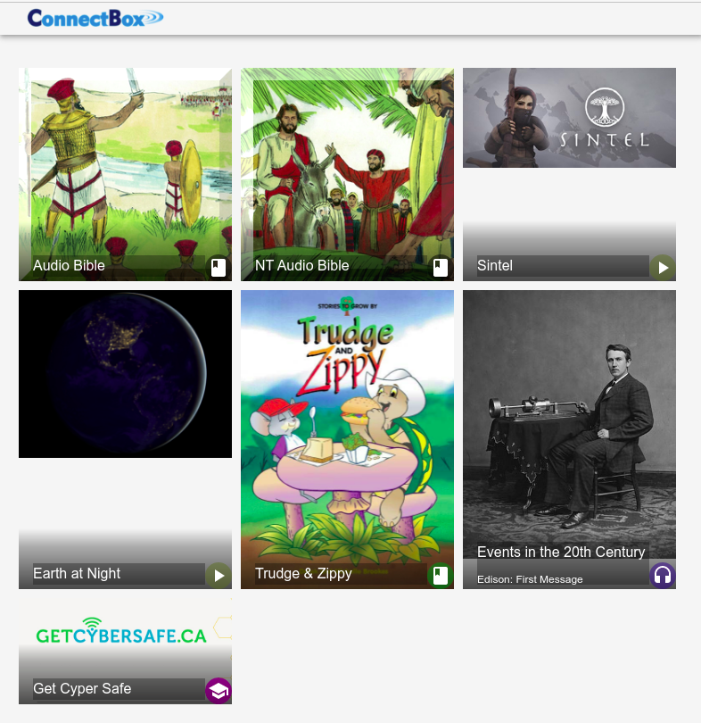
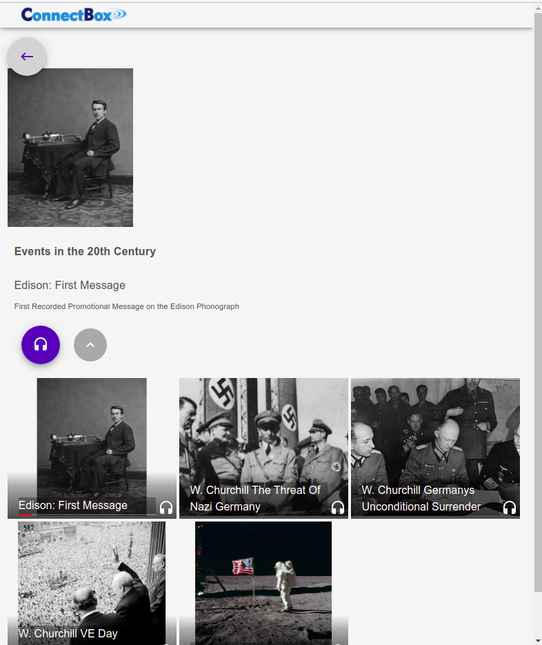
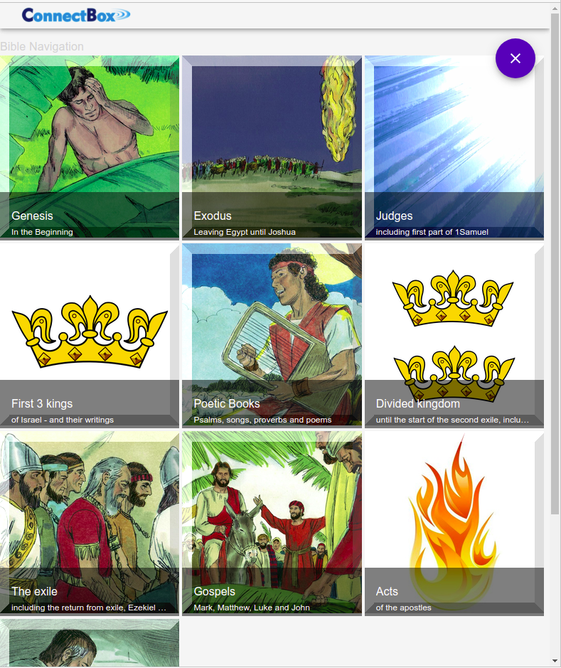
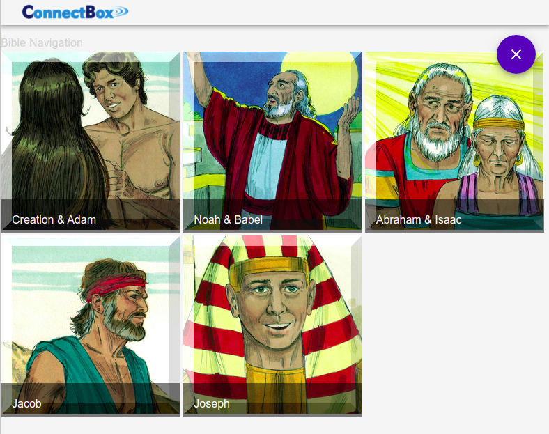
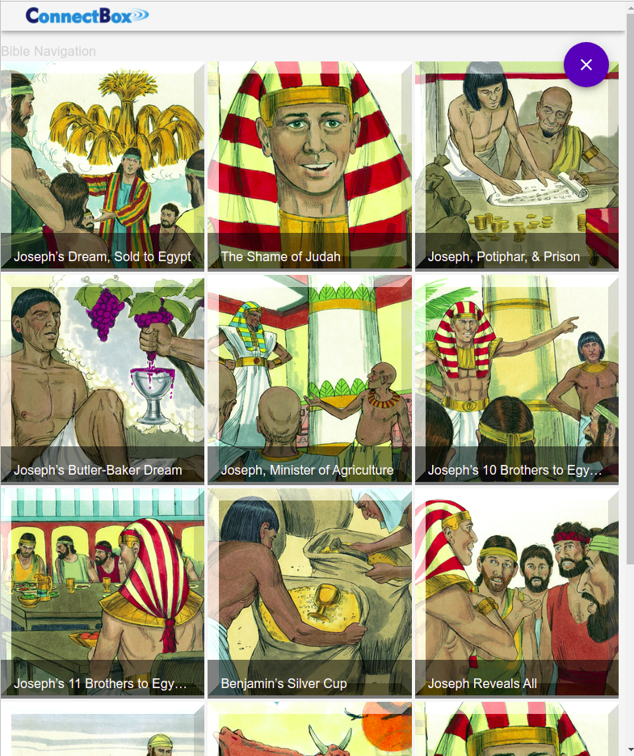

# ConnectBox Media UI Client

# cbox-media-ui-client
ConnectBox UI with easy navigation of media content - inclusive intuitive personal audio and video playlist navigation. Playback of various media types, like audio / video /  ePub / e-Learning / read-out-loud

## Requirements

For development, Node.js needs to be installed.

## Install

    $ git clone https://github.com/ORG/PROJECT.git
    $ cd PROJECT
    $ npm install

## Start - for development

    $ npm start

## Build - for production

    $ npm run build

## Deploy

Copy all the files in the "build" directory to the root folder on a static host

## Required configuration files

cbox-titles.js
  - example Json file: see /samples/config/mediaUI/cbox-titles.js

cbox-featured.js
   - example Json file: export var cbox-featured = {"eng":["Z1qmAsi","2rKLU","ZiAz7"]}

Both of the above files needs to be present in a directory /config/mediaUI

## Optional configuration files

cbox-lang.js
  - example Json file: export var languageList = ["eng","deu","fra", "esp"]

my-lang.js
  - example Json file: export var languageList = ["eng"]

Optional files in the directory /config/mediaUI

## File structure for media

There are no special requirements for the file structure for the media files. However, it is a good best practise for series to jointly keep all episodes at the same location, i.e. in a separate sub-folder (one sub-folder for each serie)

## Special file structure for an ePub library

The requirement for organising ePub file structure *(due to the option of allowing the read-out-load Readium project solution https://github.com/readium)* is as follows:

- Verify that all the content under the /public/epub/ folder is available under the static host /epub directory.
- Upload all your ePub content directly under the /epub/library on the static host *(a small example - hes_alive_-_el_vive.epub - is already available as an example under the /sample/epub/library folder)*

Both zipped epub content *(i.e. content having the .epub extension)* can be uploaded and used, as well as the alternative way to have the content unzipped *(as subfolders under the /epub/library directory - and referenced accordingly by the main .opf file, for instance: epub/library/hes_alive_-_el_vive/content.opf)*

## Special file structure for Pdf handling

When updating the Pdf library from https://github.com/wojtekmaj/react-pdf then always also copy the pdf.worker.js file from pdfjs-dist/build to the /public directory. This is in order for it to be copied to your project's output folder at build time.

## Multi Level Navigation

Audio Bible multi level hierarchical navigation is an initial first example of such a multi level navigation, which  potentially can be useful in many other situations too.

The media navigation is currently limited to two levels; series and episodes. Here is an example of a top level list:

&nbsp;

After a click on the series **"Events in the 20th Century"** this is how the currently fully implemented two level navigation looks like *(serie with episodes)*:

&nbsp;

Alternatively - after a click on **the multi level icon "Audio Bible"** instead, then here is how the demo *(still rather unfinished)* of such a conceptual navigation  looks like *(initial level: 10 top level pictures introducing the whole Bible, as stories to listen to)*:

&nbsp;

A click on the **"Genesis"** icon drills down to the level of stories about the persons *(Adam, Noah, the Patriarchs and Joseph)* who are part of the wider Genesis story:

&nbsp;

Drilling down further by selecting **"Joseph"** now opens the list of the various stories about him:

&nbsp;

The audio playback works when clicking on a certain story. However, this playback for the Audio Bible format still has some serious limitations:

- bookmarking not working
- no automatic continuing to the next audio
- navigation picture not displayed
- missing navigation hierarchical indicators

## Audio Bible special structure

Two Bible naming convention schemes are handled *(in code + structured data)*:

- **Free Audiobible** - *osisFreeAudiobible.js*
- **Faith Comes By Hearing (FCBH)** - *osisAudiobibleId.js* - For this to work there is a required "pathPattern" field, which has to be present in the series Json data. The syntax of this field is an array as follows:

  - Any string entry is used exactly as written
  - Integer 1 = a special FCBH Bible book numbering scheme
  - Integer 2 = a spelled out Bible book
  - Integer 3 = the chapter number

Example of the FCBH format:

  >"pathPattern": [1, "\_", 3, "\_", 2, "_ENGWEBN2DA.mp3"]

  For John chapter 3, then the above example is converted to:

  >B04_03_John_ENGWEBN2DA.mp3

Structured data for the Audio Bible navigation is kept in the following file in order to display titles for all chapters in the Bible:

- *osisChTitles.js*
