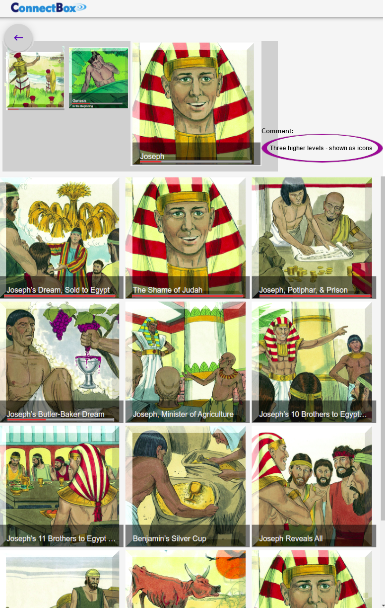

# Roadmap

## Multi Level Navigation

### Level 1
During drilling down within some multi level navigation, then the UI look needs to be adapted to be similar to the two-level navigation. Here is an example of such at the first lower level *(below the top level)*:&nbsp;

&nbsp;

>**Note:** The progress bars shown here above each indicate the last played position of that very section

### Level 2
After a click on the **"Genesis"** icon, then the next lower level looks similar. A new list is presented at the bottom part and also now both the two higher levels are visible at the top:&nbsp;

&nbsp;

>**Note:** The progress bar on the story about Joseph indicates the position of the last played story *(out of 13 episodes)*

### Level 3
A click on the **"Joseph"** icon presents the lowest level, also with a similar look. Now all three higher levels are visible at the top:&nbsp;

&nbsp;

>**Note:** The progress bars on each episode about Joseph indicate what percentage of the story has been played

### Further needed improvements:

- Strategy needed for clicking on different pictures or icons in order to **navigate down- / up-wards** vs. starting **playing** at the last played position.

- Must decide at what level the multi level navigation should stay, once the audio playback starts *(currently the navigation returns to the very top - which is counter-intuitive)*

- bookmarking last played position must be fixed *(a new multi level bookmarking strategy is needed)*

- implement automatic continuing to the next audio
